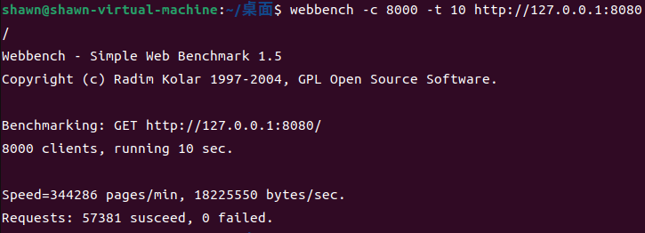

## WebServer
我的 WebServer 项目是一个基于 C++ 的高性能 Web 服务器，采用主从分离设计，结合 epoll 和线程池技术，极大地提升了服务器的吞吐能力。，一个主reactor和四个子reactor,主 Reactor 主要负责监听客户端连接请求 (accept)，并将新连接分发给子 Reactor 处理。经过webbench压力测试可以实现5700+的 QPS。

## 功能
* 利用 IO 复用技术中的 epoll 与线程池，构建主从 Reactor 架构，高效处理大规模并发请求，显著提升服务器吞吐量。
* 使用正则表达式和状态机技术，实现对 HTTP 请求报文的高效解析，支持静态资源请求处理（如 HTML、CSS、JavaScript 文件的传输）。
* 提供灵活的配置文件功能，支持动态调整服务器运行参数，包括监听端口、线程池大小、静态资源路径等，提高服务器的可维护性。
* 利用单例模式确保日志系统全局唯一，结合线程安全的阻塞队列，实现了高效的异步日志系统，用于记录服务器的运行状态、错误信息和调试日志。
* 利用RAII机制实现了数据库连接池，减少数据库连接建立与关闭的开销，同时实现了用户注册登录功能。
* 利用标准库容器封装char，实现自动增长的缓冲区；

## 环境要求
* Linux
* C++14
* Cmake
* Mysql
* Json

## 项目启动
// 建立yourdb库
```
create database yourdb;

// 创建user表
USE yourdb;
CREATE TABLE user(
    username char(50) NULL,
    password char(50) NULL
)ENGINE=InnoDB;

// 添加数据
INSERT INTO user(username, password) VALUES('name', 'password');
```
```
cd build
make
./webserver
```

## 压力测试


```
webbench -c 1000 -t 10 http://127.0.0.1:8080/
webbench -c 3000 -t 10 http://127.0.0.1:8080/
webbench -c 5000 -t 10 http://127.0.0.1:8080/
webbench -c 8000 -t 10 http://127.0.0.1:8080/

```
### 测试结果比较

| 测试项目            | Server 1: 1316          | Server 2: 8080          | 差异                             |
|---------------------|-------------------------|-------------------------|----------------------------------|
| **Speed**           | 300,834 pages/min      | 342,540 pages/min       | 8080 比 1316 快 13.8%            |
| **Bytes/sec**       | 16,210,342 bytes/sec   | 18,078,620 bytes/sec    | 8080 每秒多传输 11.5% 的字节     |
| **Requests succeed**| 50,139 requests        | 57,090 requests         | 8080 处理请求多 13.9%            |
| **Requests failed** | 0                      | 0                       | 两者稳定性相同                  |

* ubantu 22.04 内存：8g CPU i7-1065G7 虚拟机处理器：8
* QPS: 5700+ 边缘模式下相较于markparticle/WebServer提升13%

## TODO
* 日志系统 已完成
* 定时器关闭超时连接
* 单元测试

## 致谢

本项目的开发得益于以下资源与参考资料的支持，在此深表感谢：

1. **《Linux高性能服务器编程》**  
   作者：游双  
   本书提供了关于高并发网络服务器编程的理论基础与实践指导。

2. **MARK WebServer**  
   作者：@markparticle  
   项目地址：[https://github.com/markparticle/WebServer](https://github.com/markparticle/WebServer)  
   此项目为本项目的设计与实现提供了重要的参考与启发。
